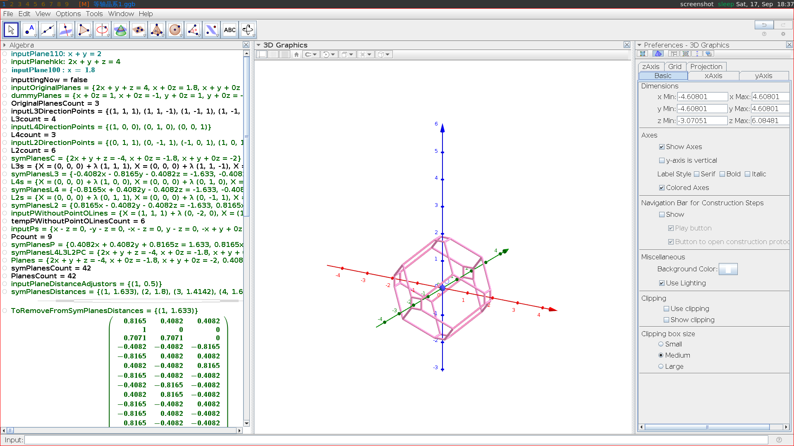

This repository is used for my testing and fixing "text input and input method" PR for DWL and other misc. works related as well.

DWL使用和配置方法类似DWM:https://ratfactor.com/dwm

另外我解释下这里的文档为啥一会儿英文，一会儿中文：最初这个代码源自github上dwl的一个pull request. 然后我好多问题搞不定，要去问原作者(详见History部分)，所以必须是英文。后来又添加了一些围绕dwl使用的相关指南，觉得中文读写都省力些，事后也懒得再翻一遍英文了。总之这个文档就是我今天改一点，明天改一点，七拼八凑的。

**sreenshots**
------------------------



geogebra 目前用xwayland,和fcitx5拼音输入的通讯依靠dbus。不过我觉得在xwayland下用，xwayland和wayland的交互看上去还是挺复杂的，如果遇到啥问题，我也是觉得在另外的TTY里打开一个DWM用比较省事，也就懒得琢磨DWL里xwayland这一块了。


kde, gnome下的文件管理器通常会带很多桌面环境依赖项.我除了用ranger,发现rfm挺好的，suckless的风格。配合imv看图,我做了一个小的配置改动，添加了一段小脚本，以便每次双击图片缩略图时不用打开新的IMV窗口，而是刷新现有窗口 : https://gitee.com/guyuming76/rfm/commit/c2bdc92c6b50f578032f2986dc40db8781dfb8ac 。我觉得这个例子比较好地体现了我对动态平铺窗口管理的理解：把传统的庞大的GUI应用分拆成小的独立应用。

**How to start dwl**
--------------------

The command i use to start dwl from tty:

```
dbus-run-session dwl -s ~/dwlstart.sh
dbus-run-session dwl -s ~/dwlstart.sh 2>/tmp/dwlerr.log
dbus-run-session dwl -s ~/dwlstart.sh -i 2>/tmp/dwlerr.log
# -d level log add the keypress events based on -i level, which is large in quantity
dbus-run-session dwl -s ~/dwlstart.sh -d 2>/tmp/dwlerr.log
```

the content of dwlstart script:

```
#!/bin/sh

fname="$HOME"/.cache/dwltags

gentoo-pipewire-launcher &

#fcitx5 -d
fcitx5 -d --disable dbus
#https://github.com/fcitx/fcitx5/discussions/523
#in /etc/environment, i have GTK_IM_MODULE="wayland"
#and in .xinitrc, i have export GTK_IM_MODULE="fcitx"

#fcitx5 --verbose "*=5" -d

waybar --log-level debug > /tmp/waybar.log  &
#i cloned waybar project here:https://gitee.com/guyuming76/dwl
#all i did is adding spdlog entries to help me understand how waybar works.

eval "/home/guyuming/HDMI.sh dwl" &
#调用脚本，用wlr-randr命令设置多显示器模式，比如让投影仪复制显示主屏幕

while
	read line; do echo $line >> ${fname} ;
done
```


-------------------------------------------------------------------------------------------
**How to install my waybar script**
-----------------------------------
i put waybar related scripts in the following link, i think better way to clean the ~/.cache/dwltags file should be provided.

https://gitee.com/guyuming76/personal/tree/dwl/gentoo/waybar-dwl

1. copy the config and style.css files to override the waybar defaults, in my case, /etc/xdg/waybar/config  /etc/xdg/waybar/style.css
2. copy waybar-dwl.sh to ~/waybar-dwl.sh, which is referenced in the config file above
3. copy dwlstart.sh to ~/dwlstart.sh and modify it as you need, waybar is started in it
4. the config file depends on wtype package(from gentoo guru repository in my case) in on-click event, if you don't want to use it, you can remove all those on-click lines. And the MOD key is default to alt here, if you have customized the MOD key in dwl config.h, change alt to your custom MOD key here in config accordingly.

run dbus-run-session dwl -s ~/dwlstart.sh to start dwl. you might find that the current selected tag for waybar is not highlighted, you can run ~/.cache/dwltags, the first column contains the name of your monitor. Then you can edit the waybar-dwl.sh, find the monitor= line and assign it with your monitor name.

-------------------------------------------------------------------------------------------
Waybar用到 spdlog ,  http://t.zoukankan.com/shuqin-p-12214439.html 提到“多生产者多消费者队列 默认为阻塞模式，也可以设置为非阻塞，不过这个非阻塞的处理非常简单粗暴，就是简单的丢弃最老的日志，推荐是不要这样设置滴，一般产生阻塞的情况大概是磁盘IO打满了，出现这个情况一般是别的地方出问题了。


-------------------------------------------------------------------------------------------------


**DWL下设置投影仪**
--------------------------------
用wlr-randr,我在gentoo上是从guru仓库安装的。wlr-randr 貌似没有--left-of 参数，但可以用--pos设置输出起始坐标，如果投影仪和显示器起始坐标都是0,0,效果就相当于“双屏复制”显示

```
cat ~/HDMI.sh

sleep 10
#当本脚本是从 dwl -s 参数中启动得话，需要等待dwl 中 wayland 事件循环启动后才能执行 wlr-randr,所以这里sleep一会儿 https://github.com/djpohly/dwl/issues/266

if [[ ${1} == "dwl" ]];then
      wlr-randr --output HDMI-A-1 --mode 1360x768
      wlr-randr --output HDMI-A-1 --pos 0,0
      #wlr-randr --output HDMI-A-1 --scale 1.5
      # https://github.com/fcitx/fcitx5/discussions/551
elif [[ ${1} == "dwm" ]];then
      xrandr --output HDMI-1 --mode 1360x768
      #xrandr --output HDMI-1 --left-of LVDS-1
      #xrandr --output HDMI-1 --scale 0.5x0.5
      xrandr --output HDMI-1 --pos 0x0
      xrandr --output LVDS-1 --pos 0x0
else
     echo "usage: HDMI.sh dwl"
     echo "       HDMI.sh dwm"
fi
```

--------------------------------------------------------------------------------------------
**MISC**
---------------
[合并上游更新操作步骤](stepsToMergeUpstreamMain.md)

 **另外，我不一定能及时合并Upstream的更新，关于输入法的那个pull request的代码，我加了#ifdef IM 这个编译条件，找到这个编译条件包含的代码，手工复制到上游代码理论上也行。** 


[History](History.md) 
